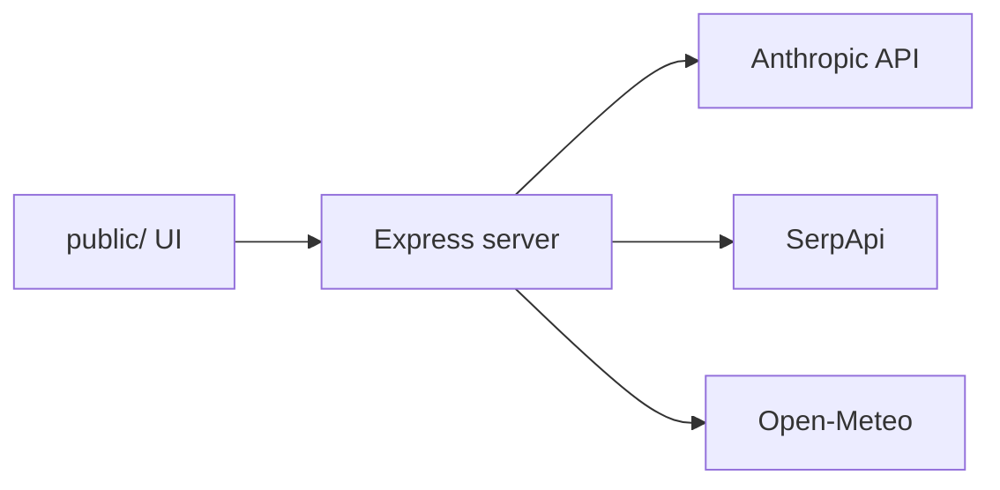

# AI Travel Assistant

AI-powered travel assistant that finds destinations, compares real-time flights, checks weather via **Open-Meteo**, and recommends the best options.

## v4 architecture



| Layer | Role |
|-------|------|
| **Orchestrator** | Claude Sonnet — requirements chat |
| **Destinations** | Claude Haiku — shortlist (cached, no web search) |
| **Flights** | SerpApi Google Flights (server-side) |
| **Weather** | Open-Meteo geocoding + forecast/archive (**no LLM**) |
| **Recommendation** | Claude Sonnet — final top 3 |

API keys live in **server `.env` only** — not in the browser.

## Quick start

```bash
cp .env.example .env
# Edit .env: ANTHROPIC_API_KEY and SERPAPI_KEY

npm install
npm start
```

Open **http://localhost:3000**

On a phone (same Wi‑Fi): `http://<your-computer-ip>:3000`

### Mobile app

The UI is **mobile-first** and supports:

- **PWA** — install from the browser (Add to Home Screen)
- **Capacitor** — wrap as iOS/Android for the App Store / Play Store

See **[docs/MOBILE.md](docs/MOBILE.md)** for deployment steps.

```bash
npm run cap:sync      # after npm install (includes Capacitor)
npm run cap:open:android
npm run cap:open:ios
```

Development with auto-reload:

```bash
npm run dev
```

## Environment variables

| Variable | Required | Description |
|----------|----------|-------------|
| `ANTHROPIC_API_KEY` | Yes | Claude API for orchestrator, destinations, recommendation |
| `SERPAPI_KEY` | Yes | Live flight search |
| `PORT` | No | Default `3000` |

## API endpoints

| Method | Path | Description |
|--------|------|-------------|
| GET | `/api/health` | Server status and key configuration |
| POST | `/api/chat` | Orchestrator message `{ message, conversationHistory }` |
| POST | `/api/search/stream` | SSE search pipeline `{ preferences }` |

## Legacy v3 (browser-only)

The root-level `*-agent.js` files are the previous browser-based multi-agent version. v4 uses `server/` and `public/` instead.

## Branches

- `main` — earlier versions
- `v3-multi-agent` — browser multi-agent
- `v4` — backend + Open-Meteo (this layout)
